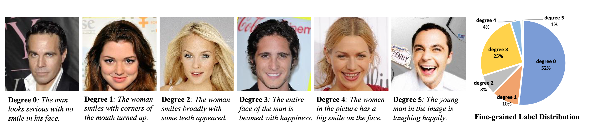

# CelebA-Dialog Dataset

**Talk-to-Edit: Fine-Grained Facial Editing via Dialog** </br>
[Yuming Jiang*](https://yumingj.github.io/),
[Ziqi Huang*](https://ziqihuangg.github.io/),
[Xingang Pan](https://xingangpan.github.io/),
[Chen Change Loy](https://www.mmlab-ntu.com/person/ccloy/)
and
[Ziwei Liu](https://liuziwei7.github.io/) </br>
In IEEE International Conference on Computer Vision (**ICCV**), 2021.

From [MMLab@NTU](https://www.mmlab-ntu.com/index.html) affliated with S-Lab, Nanyang Technological University.


[**[Project Page]**](https://www.mmlab-ntu.com/project/talkedit/) | [**[Paper]**](https://arxiv.org/abs/2109.04425) | [**[Code]**](https://github.com/yumingj/Talk-to-Edit) | [**[Video]**](https://www.youtube.com/watch?v=ZKMkQhkMXPI)

**CelebA-Dialog** is a large-scale visual-language face dataset with the following features:
- Facial images are annotated with rich **fine-grained labels**, which classify one attribute into multiple degrees according to its semantic meaning.
- Accompanied with each image, there are **captions** describing the attributes and a **user request** sample.




The dataset can be employed as the training and test sets for the following computer vision tasks: fine-grained facial attribute recognition, fine-grained facial manipulation, text-based facial generation and manipulation, face image captioning, natural language based facial recognition and manipulation, and broader multi-modality learning tasks.
The dataset is proposed in [Talk-to-Edit](https://github.com/yumingj/Talk-to-Edit).

## Download Links
You can download using the following links:
* "**HQ**" refers to images and corresponding annotations for the 30,000 high-resolutions images following CelebA-HQ.
* "**standard**" refers to images and corresponding annotations for original 202,599 CelebA images.

| Path | Size | Files | Format | Description
| :--- | :-------- | --: | :----: | :----------
| [CelebA-Dialog (HQ)](https://drive.google.com/drive/folders/1YRRaC3LWLHorVhFNJPzVqLrUlA10eLEJ?usp=sharing) | ~4.4 GB |  | | 30,000 high-resolution images and corresponding annotations
| &boxvr;&nbsp; [image (HQ)](https://drive.google.com/file/d/1A2dNWabg6_um-V3lhw1tyead5hCpjaW8/view?usp=sharing) | ~2.7 GB | 30,000 | JPG | images from CelebA-HQ
| &boxvr;&nbsp; [classification label (HQ)](https://drive.google.com/drive/folders/1aEBwVe4syZjCayambAnonfAI2m3JsMcP?usp=sharing) | ~4.1 MB | 2 | TXT | manually annotated classification labels
| &boxvr;&nbsp; [text (HQ)](https://drive.google.com/drive/folders/1CzTZm8suzDWdoN6DQmv11tsZotYo1Yfu?usp=sharing) | ~27 MB | 4 | TXT and JSON | natural language captions and editing requests
| &boxvr;&nbsp; [mask (HQ)](https://drive.google.com/drive/folders/1bRZmrUBz8y0ObTr8AlkbVfyUco5R2I0z?usp=sharing) | ~1.8 GB |  | PNG | segmentation masks (1) [binary](https://drive.google.com/file/d/1MUYHw-IGP5FHy0yJzgvXNZojlcnCq7IE/view?usp=sharing) (2) [colorized](https://drive.google.com/file/d/1q2DWtGA1h4NcS1Az4OX-5sbLXsGWJZWq/view?usp=sharing)
| [CelebA-Dialog (standard)](https://drive.google.com/drive/folders/18nejI_hrwNzWyoF6SW8bL27EYnM4STAs?usp=sharing) |  |  | | 202,599 original CelebA images and corresponding annotations
| &boxvr;&nbsp; [image (standard)](https://drive.google.com/drive/folders/0B7EVK8r0v71pTUZsaXdaSnZBZzg?resourcekey=0-rJlzl934LzC-Xp28GeIBzQ&usp=sharing) | |  |  | images from CelebA
| &boxvr;&nbsp; classification label (standard) | |  | TXT | manually annotated classification labels: (1) [fine-grained labels for 5 attributes](https://drive.google.com/file/d/1wZcVEjJ5LwP1Ciuc3j_RFw9Vcusj4UEU/view?usp=sharing), (2) [binary labels for 40 attributes](https://drive.google.com/file/d/0B7EVK8r0v71pblRyaVFSWGxPY0U/view?usp=sharing&resourcekey=0-YW2qIuRcWHy_1C2VaRGL3Q)
| &boxvr;&nbsp; [text (standard)](https://drive.google.com/drive/folders/18nejI_hrwNzWyoF6SW8bL27EYnM4STAs?usp=sharing) | ~14 MB |  | TXT and JSON | (1) [editing request](https://drive.google.com/drive/folders/1Ajt1xEwMQ0bkrHc-F1tSgeShnpmnLZ_N?usp=sharing), (2) [image caption](https://drive.google.com/drive/folders/1HmY0Qvq66B0SNvDLTt2kHem8vVuV3FQx?usp=sharing)
| [HQ-to-standard mapping](https://drive.google.com/file/d/10msPsx1Fouh5h8m8LoSaPTh9R4dv_mLG/view?usp=sharing) | ~1 MB | 1 | TXT | The mapping between 30,000 CelebA-HQ images and the 202,599 CelebA images


### Image

* 30,000 face images selected from the CelebA dataset by following CelebA-HQ
* High resolution of 1024 x 1024

### Classification Label

* 40 binary attributes annotations per image
* 5 fine-grained attributes annotations per image: Bangs, Eyeglasses, Beard, Smiling, and Age

### Text

* Textual captions for each image
* A user editing request per image

### Mask

We preprocess the facial segmentation masks of [CelebAMask-HQ](https://mmlab.ie.cuhk.edu.hk/projects/CelebA/CelebAMask_HQ.html) to ease future research.
* You can directly download the ***binary masks for individual labels*** for each image. These are the same as the ones provided in CelebAMask-HQ. ([Download link](https://drive.google.com/file/d/1MUYHw-IGP5FHy0yJzgvXNZojlcnCq7IE/view?usp=sharing))
* We produce the ***combined colorized mask*** for each image following the parsing of CelebAMask-HQ. ([Download link](https://drive.google.com/file/d/1q2DWtGA1h4NcS1Az4OX-5sbLXsGWJZWq/view?usp=sharing))


Below is the color-to-label parsing information:

| Label list | | | | |
| ------------ | ------------- | ------------ | ------------- | ------------ |
| 0: 'background' | 1: 'skin' | 2: 'nose' |  3: 'eye_g' | 4: 'l_eye' |
| 5: 'r_eye' | 6: 'l_brow' | 7: 'r_brow' | 8: 'l_ear' | 9: 'r_ear' |
| 10: 'mouth' | 11: 'u_lip' | 12: 'l_lip' | 13: 'hair' | 14: 'hat' |
| 15: 'ear_r' | 16: 'neck_l' | 17: 'neck' | 18: 'cloth' | | |

```python
from PIL import Image
import numpy as np

segm = Image.open(f)
segm = np.array(segm) # shape: [512, 512]
```

## Agreement
* The CelebA-Dialog dataset is available for non-commercial research purposes only.
* You agree not to reproduce, duplicate, copy, sell, trade, resell or exploit for any commercial purposes, any portion of the images and any portion of derived data.
* You agree not to further copy, publish or distribute any portion of the CelebA-Dialog dataset. Except, for internal use at a single site within the same organization it is allowed to make copies of the dataset.

## Citation

If you find this dataset useful for your research and use it in your work, please consider cite the following papers:

```bibtex
@InProceedings{CelebA-Dialog,
  title = {Talk-to-Edit: Fine-Grained Facial Editing via Dialog},
  author = {Jiang, Yuming and Huang, Ziqi and Pan, Xingang and Loy, Chen Change and Liu, Ziwei},
  booktitle = {Proceedings of the IEEE/CVF International Conference on Computer Vision},
  year={2021}
}

@inproceedings{CelebAMask-HQ,
  title = {MaskGAN: Towards Diverse and Interactive Facial Image Manipulation},
  author = {Lee, Cheng-Han and Liu, Ziwei and Wu, Lingyun and Luo, Ping},
  booktitle = {IEEE Conference on Computer Vision and Pattern Recognition (CVPR)},
  year = {2020}
}

@inproceedings{CelebA-HQ,
  title={Progressive Growing of {GAN}s for Improved Quality, Stability, and Variation},
  author={Tero Karras and Timo Aila and Samuli Laine and Jaakko Lehtinen},
  booktitle={International Conference on Learning Representations},
  year={2018},
}

@inproceedings{CelebA,
  title = {Deep Learning Face Attributes in the Wild},
  author = {Liu, Ziwei and Luo, Ping and Wang, Xiaogang and Tang, Xiaoou},
  booktitle = {Proceedings of International Conference on Computer Vision (ICCV)},
  month = {December},
  year = {2015}
}
```
